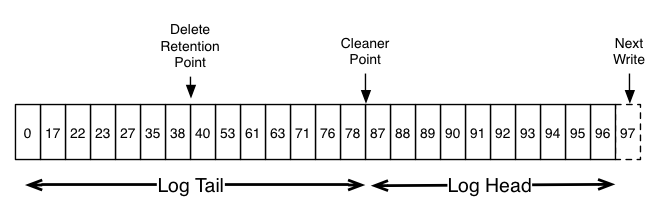
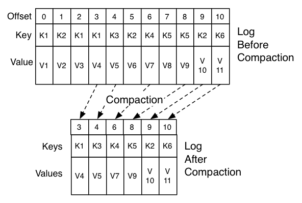

# Kafka Log compaction playground

## When to use it?

* Setting the policy to compact only makes sense on topics for which applications produce events that contain both a `key` and a `value`.
* Keep a `SNAPSHOT` instead of full history

## Use cases?

It makes sense to store only the latest salary for each employee rather than the historical data for a limited period of time.

## Topic retention

Retention is enforced by:
* size or time
* compaction

## Description

Log cleanup happens on the partition segments. Segments divide partition data into smaller files that can be managed better and cleaned independently.

Log compaction is a mechanism to give:
* finer-grained `per-record retention`
* rather than the coarser-grained `time-based retention`.
* Selectively remove records where we have a more recent update with the same primary key.
* the log is guaranteed to have at least the last state for each key
* this retention policy can be set per-topic

* Tombstone records
    * Compaction also allows for deletes
    * A message with a key and a null payload will be treated as a delete from the log
    * This delete marker will cause any prior message with that key to be removed (as would any new message with that key)
    * delete markers are special in that they will themselves be cleaned out of the log after a period of time to free up space
    * The point in time at which deletes are no longer retained is marked as the "delete retention point"



The compaction is done:
* in the background
* by periodically recopying log segments.
* Cleaning does not block reads
* can be throttled to use no more than a configurable amount of I/O throughput to avoid impacting producers and consumers.



## Head of the log

* The head of the log is identical to a traditional Kafka log.
* Contains sequential offsets and retains all messages

## Tail of the log

* Log compaction adds an option for handling the tail of the log
* messages in the tail of the log retain the original offset assigned when they were first written
* all offsets remain valid positions in the log, even if the message with that offset has been compacted away

## Guarantees

* Consumer
    * Any consumer that stays caught-up to within the head of the log will see every message that is written these messages will have sequential offsets.
    * Any consumer progressing from the start of the log will see at least the final state of all records in the order they were written.
    * all delete markers for deleted records will be seen, provided the consumer reaches the head of the log in a time period less than the topic's `delete.retention.ms`
        * In other words: since the removal of delete markers happens concurrently with reads, it is possible for a consumer to miss delete markers if it lags by more than `delete.retention.ms`
* Partition
    * Ordering of messages is always maintained.
    * Compaction will never re-order messages, just remove some.
    * The offset for a message never changes. It is the permanent identifier for a position in the log. Offsets are just skipped if a message is missing.

## Configuration

### Topic related settings

* `cleanup.policy`
  * Specifies the retention policy to use on old log segments
  * `compact`: will enable log compaction on the topic
  * Default value: `delete`
  * [Confluent Documentation](https://docs.confluent.io/platform/current/installation/configuration/topic-configs.html#topicconfigs_cleanup.policy)

Topics are divided into partitions.
Partitions are divided on the broker into segments

New segments are created in Kafka when:
* `segment.ms`:
  * Controls the period of time after which Kafka will force the log to roll even if the segment file isn't full to ensure that retention can delete or compact old data.
  * Default value: 7 days (`604800000` ms)
  * [Confluent Documentation](https://docs.confluent.io/platform/current/installation/configuration/topic-configs.html#topicconfigs_segment.ms)

* `segment.bytes`:
  * Controls the segment file size for the log
  * Default value: 1 GB (`1073741824` bytes)
  * When your segment size become bigger than this value, Kafka will create a new segment.
  * [Confluent Documentation](https://docs.confluent.io/platform/current/installation/configuration/topic-configs.html#topicconfigs_segment.bytes)

* `delete.retention.ms`:
  * Controls the amount of time to retain delete tombstone markers for log compacted topics.
  * This setting also gives a bound on the time in which a consumer must complete a read if they begin from offset 0 to ensure that they get a valid snapshot of the final stage (otherwise delete tombstones may be collected before they complete their scan).
  * Default value: 1 day (`86400000` ms)
  * [Confluent Documentation](https://docs.confluent.io/platform/current/installation/configuration/topic-configs.html#topicconfigs_delete.retention.ms)

* `min.cleanable.dirty.ratio`:
  * Controls how frequently the log compactor will attempt to clean the log
  * By default, Kafka will avoid cleaning a log where more than 50% of the log has been compacted.
  * This ratio bounds the maximum space wasted in the log by duplicates (at 50% at most 50% of the log could be duplicates)
  * Higher ratio will mean fewer, more efficient cleanings but will mean more wasted space in the log
  * Depends on configuration: 
    * `cleanup.policy`
    * Required settings: `compact`
  * Related to configuration:
    * `max.compaction.lag.ms`:
    * `min.compaction.lag.ms`: 
  * Default value: `0.5`
  * [Confluent Documentation](https://docs.confluent.io/platform/current/installation/configuration/topic-configs.html#topicconfigs_min.cleanable.dirty.ratio)

* `max.compaction.lag.ms`
  * Controls the maximum time a message will remain ineligible for compaction in the log
  * Default value: 9223372036854775807
  * [Confluent Documentation](https://docs.confluent.io/platform/current/installation/configuration/topic-configs.html#topicconfigs_max.compaction.lag.ms)

* `min.compaction.lag.ms`
  * used to guarantee the minimum length of time must pass after a message is written before it could be compacted
  * it provides a lower bound on how long each message will remain in the (uncompacted) head.
  * used to guarantee the maximum delay between the time a message is written and the time the message becomes eligible for compaction.
  * Default value: `0`
  * [Confluent Documentation](https://docs.confluent.io/platform/current/installation/configuration/topic-configs.html#topicconfigs_min.compaction.lag.ms)

### Broker related settings

`log.cleanup.policy`

`log.cleaner.min.compaction.lag.ms`
* The log cleaner can be configured to retain a minimum amount of the uncompacted "head" of the log
* If not set, all log segments are eligible for compaction except for the last segment, i.e. the one currently being written to
* The active segment will not be compacted even if all of its messages are older than the minimum compaction time lag

`log.cleaner.max.compaction.lag.ms`

* The log cleaner can be configured to ensure a maximum delay after which the uncompacted "head" of the log becomes eligible for log compaction.
* This can be used to prevent log with low produce rate from remaining ineligible for compaction for an unbounded duration.
* If not set, logs that do not exceed `min.cleanable.dirty.ratio` are not compacted.

### Kafka Broker metrics compaction

Compaction deadline is not a hard guarantee since it is still subjected to the availability of log cleaner threads and the actual compaction time.
You will want to monitor metrics:

* `uncleanable-partitions-count`
* `max-clean-time-secs`
* `max-compaction-delay-secs`

### What is log compaction not solving?

* De-duplication is done after a segment is committed. Your consumers will still read from the tail of a log segment as soon as the data arrives. It is not a way to perform de-duplication of messages.
* If a consumer re-starts, it may see duplicate data, based on the `at-least-once` reading semantics we have seen before.

### Questions

Can I trigger compaction?
Answer: no it's happening in the background

### CLI

#### Create compact topic

Create a compacted topic:

```
kafka-topics --bootstrap-server localhost:9092 --create --topic stock-quotes \
             --partitions 1 --replication-factor 1 \
             --config cleanup.policy=compact \
             --config min.cleanable.dirty.ratio=0.001 \
             --config segment.ms=5000
```

Default values: 
* `segment.ms`= 604800000 (7 days)
  * This configuration controls the period of time after which Kafka will force the log to roll even if the segment file isn't full to ensure that retention can delete or compact old data.
* `segment.bytes`= 1073741824 (1 Gigabyte)
  * This configuration controls the period of time after which Kafka will force the log to roll even if the segment file isn't full to ensure that retention can delete or compact old data.

 
Describe the topic:

```
kafka-topics --bootstrap-server localhost:9092 --describe \
             --topic stock-quotes
```

Produce stock ticks:

```
kafka-console-producer --bootstrap-server localhost:9092 \
                       --topic stock-quotes \
                       --property parse.key=true \
                       --property key.separator=,
```

AAPL, price=900
INGB, price=10
AMZN, price=2500
GOOGL, price=500

INGB, price=9
AMZN, price=2520

INGB, price=8

INGB, null

```
kafka-console-consumer --bootstrap-server localhost:9092 \
                       --topic stock-quotes \
                       --from-beginning \
                       --property print.offset=true \
                       --property print.partition=true \
                       --property print.key=true \
                       --property key.separator=,
```

Consume with Kafkacat:

```
kafkacat -C -b kafka:29092 -t stock-quotes -Z
```

Produce tombstone record:

Be aware the console producer still can't send tombstone records.
See: https://issues.apache.org/jira/browse/KAFKA-10238

```
kafka-console-producer --bootstrap-server localhost:9092 \
                       --topic stock-quotes \
                       --property parse.key=true \
                       --property key.separator=,
```

```
INGB,null
```

Will result in a value of `"null"` (String).

Kafka cat can send tombstone records:

```
echo "INGB," | kafkacat -b kafka:29092 -t stock-quotes -Z -K,
```

[KIP-71 - Enable log compaction and deletion to co-exist](https://cwiki.apache.org/confluence/display/KAFKA/KIP-71%3A+Enable+log+compaction+and+deletion+to+co-exist)
[Kafka Topic Configuration: Log Compaction](https://www.conduktor.io/kafka/kafka-topic-configuration-log-compaction)

[https://ibm.github.io/event-streams/installing/capacity-planning/]
[Deep dive into Apache Kafka storage internals: segments, rolling and retention](https://strimzi.io/blog/2021/12/17/kafka-segment-retention/)

https://www.conduktor.io/kafka/kafka-topics-internals-segments-and-indexes

* [Log Compacted Topics in Apache Kafka](https://towardsdatascience.com/log-compacted-topics-in-apache-kafka-b1aa1e4665a7)

You can specify both delete and compact values for the `cleanup.policy` configuration at the same time.

In this case, the log is compacted, but the cleanup process also follows the:
* retention time
* or size limit settings ( By default there is no size limit only a time limit).

## Kafka log dir location

log.dirs = /var/lib/kafka/data

```
cd /var/lib/kafka/data/stock-quotes-0
watch ls -l
```


## Cleanup policy both compact and delete 

```
kafka-topics --bootstrap-server localhost:9092 --describe \
             --topic stock-quotes-compact-and-delete
```

Topic: stock-quotes-compact-and-delete  TopicId: 1lgmcSQiSG-Yshps0d_jpA PartitionCount: 1       ReplicationFactor: 1    Configs: min.insync.replicas=1,cleanup.policy=compact,delete,retention.ms=300000,max.message.bytes=1000012,retention.bytes=-1
Topic: stock-quotes-compact-and-delete  Partition: 0    Leader: 1001    Replicas: 1001  Isr: 1001


```
kafka-configs --bootstrap-server localhost:9092 --alter --entity-type topics --entity-name stock-quotes --add-config cleanup.policy='[compact,delete]'
```

* [Confluent Forum - Cleanup Policy of compact AND delete](https://forum.confluent.io/t/cleanup-policy-of-compact-and-delete/868/)
* [KAFKA-40150 - Change cleanup.policy config to accept a list of valid policies](https://issues.apache.org/jira/browse/KAFKA-4015)

## Docker

Start:

```
docker-compose -f docker-compose.yml -f docker-compose-monitoring.yml up -d
docker compose up -d
```

Stop:

```
docker-compose -f docker-compose.yml -f docker-compose-monitoring.yml down -v
```

```
docker compose down -v
```

Including monitoring setup:

```
docker compose -f docker-compose.yml -f docker-compose-monitoring.yml up -d
```

```
docker compose -f docker-compose.yml -f docker-compose-monitoring.yml down -v
```

### Apple M1 Macbook (ARM64)

For Apple M1 Macbook (ARM64): 

Start

```
docker compose -f docker-compose.yml -f docker-compose-arm64.yml up -d
```

Stop:

```
docker compose -f docker-compose.yml -f docker-compose-arm64.yml down -v
```

Including monitoring:

```
docker compose -f docker-compose.yml -f docker-compose-arm64.yml -f docker-compose-monitoring.yml up -d
```


```
docker compose -f docker-compose.yml -f docker-compose-arm64.yml -f docker-compose-monitoring.yml down -v
```

